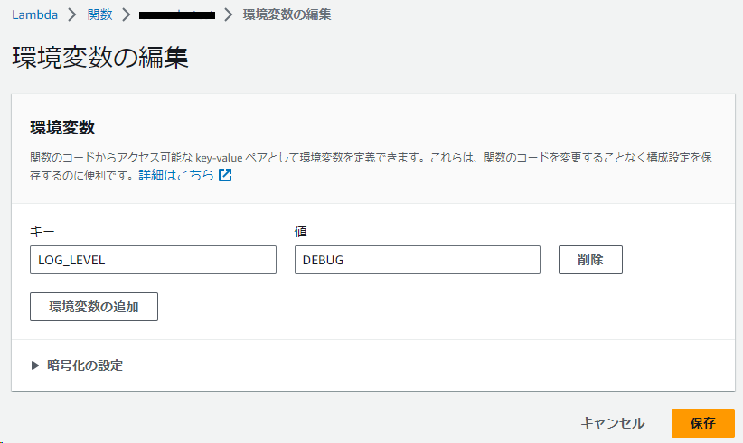

# lambda-logging
Logging sample code for AWS lambda.

# 説明

* python_version :  3.8.18
* boto3.version :  1.26.90

AWS Lambdaの環境変数を設定することで再デプロイすることなくログ出力レベルを変更できます。

```
キー：
LOG_LEVEL
値：
DEBUG/INFO/WARNING/ERROR/CRITICAL
```

※ 環境変数が設定されていない場合（デフォルト）は [WARNING] 以上がログ出力されます。

# 設定例

例えば [DEBUG] レベル で設定したい場合は環境変数を次のように設定します。



この場合、以下のようにログ出力されます。


### Function Logs
```
START RequestId: 8f7cc01d-7649-449e-b2f8-b3405b4e1ab3 Version: $LATEST
[DEBUG]	2024-03-08T08:16:09.730Z	8f7cc01d-7649-449e-b2f8-b3405b4e1ab3	start
[DEBUG]	2024-03-08T08:16:09.730Z	8f7cc01d-7649-449e-b2f8-b3405b4e1ab3	python_version : 3.8.18
[DEBUG]	2024-03-08T08:16:09.730Z	8f7cc01d-7649-449e-b2f8-b3405b4e1ab3	boto3.version : 1.26.90
[DEBUG]	2024-03-08T08:16:09.730Z	8f7cc01d-7649-449e-b2f8-b3405b4e1ab3	これは [DEBUG] レベルのログ出力です
[INFO]	2024-03-08T08:16:09.730Z	8f7cc01d-7649-449e-b2f8-b3405b4e1ab3	これは [INFO] レベルのログ出力です
[WARNING]	2024-03-08T08:16:09.730Z	8f7cc01d-7649-449e-b2f8-b3405b4e1ab3	これは [WARNING] レベルのログ出力です
[ERROR]	2024-03-08T08:16:09.730Z	8f7cc01d-7649-449e-b2f8-b3405b4e1ab3	これは [ERROR] レベルのログ出力です
[CRITICAL]	2024-03-08T08:16:09.730Z	8f7cc01d-7649-449e-b2f8-b3405b4e1ab3	これは [CRITICAL] レベルのログ出力です
[DEBUG]	2024-03-08T08:16:09.730Z	8f7cc01d-7649-449e-b2f8-b3405b4e1ab3	success
[DEBUG]	2024-03-08T08:16:09.730Z	8f7cc01d-7649-449e-b2f8-b3405b4e1ab3	finally
END RequestId: 8f7cc01d-7649-449e-b2f8-b3405b4e1ab3
REPORT RequestId: 8f7cc01d-7649-449e-b2f8-b3405b4e1ab3	Duration: 15.57 ms	Billed Duration: 16 ms	Memory Size: 128 MB	Max Memory Used: 53 MB	Init Duration: 290.73 ms
```

# 参考

* https://docs.aws.amazon.com/ja_jp/lambda/latest/dg/python-logging.html
* https://docs.python.org/ja/3/library/logging.html
